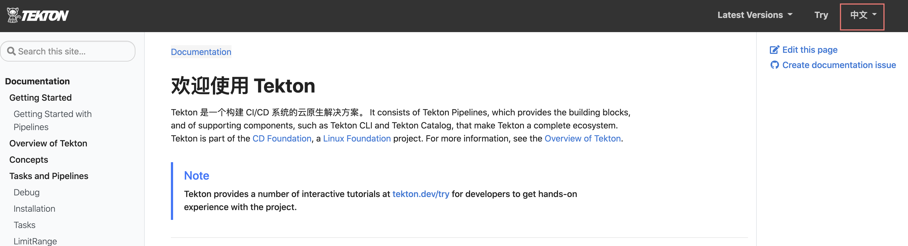
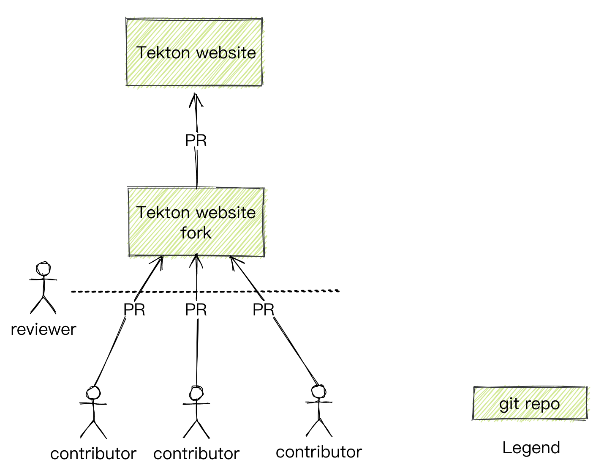

# Proposal: `Translate Tekton website`

Author:

- Zhipeng Yu [@yuzp1996](https://github.com/yuzp1996)

## Abstract

Add Chinese localization support to Tekton website

## Background

Tekton has become an increasingly popular CI/CD tool, and many Chinese developers want to learn how to use it. As we all know, official documentation is the best way to learn Tekton, but the documentation does not yet support Chinese. For some people who are not familiar with English, it is inconvenient to read English documents.

So we want to add Chinese support to the Tekton website

## Proposal

### Goal
Add Chinese translate support for the [Tekton website](https://tekton.dev/) to make sure developers can switch language with the button.

### Overall Process

We need to fork the [Tekton website repository](https://github.com/tektoncd/website)  as our main repository and contributor need to make pull-request to this repository.

The reviewer can help review the change and merge it to the repository.
 
When the repository is ready to be merged we can make pullrequest to the [Tekton website](https://github.com/tektoncd/website) and merge it

### Steps
#### Prepare a repository as main repository
We need to prepare a repository for translation and we can review and make sure that our work is ready to be merged.

#### Discuss the best way with the Tekton community
Discuss with the Tekton community if they can merge our contributions, or if they have any other better ways to do this

#### The guide describes how to contribute
We need a guide to describe how to start contributing. So people can start their contribution quickly

#### Split tasks into issues
Split the translation task into different issues, the contributor can choose what he wants to do and make sure we can track it

### What has been done
Some work has been done for this proposal.

[@yuzp1996](https://github.com/yuzp1996) has make some progress in his own github repository. You can reference this [PR](https://github.com/yuzp1996/website/pull/1). 

When we have obtained the main repository that we mentioned in the steps, we can move the changes to the main repository.

If you want to contribute right now, you can follow the steps

1. Clone [this repository](https://github.com/yuzp1996/website) and checkout your branch
2. Read the [document](https://github.com/yuzp1996/website/blob/main/DEVELOPMENT.md) about how to start website on your machine
3. Change the content in the files located in the /content/zh 
4. Start website on your machine and check your change
5. Make sure every thing is OK then you can make a pullrequest